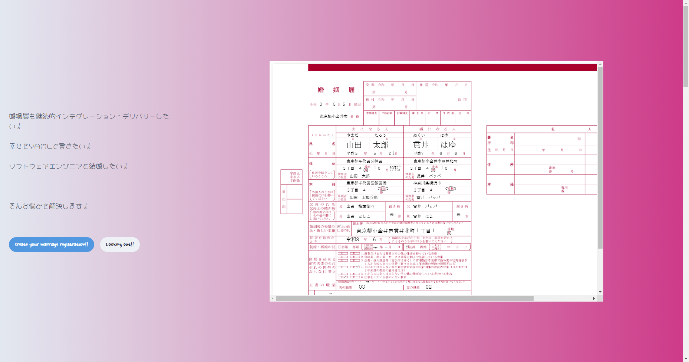

# GitHub Marriage Registration

🌐 Languages:

**English** | [日本語](README.md)



> Want to apply continuous integration and delivery to your marriage registration too! Want to write your happiness in YAML! Want to marry a software engineer! This solves those problems!


## Table of contents <!-- omit in toc -->

* [Overview](#overview)
* [Initial setup](#initial-setup)
* [Configuration](#configuration)
  * [Details](#details)
* [Usage - run it locally](#usage---run-it-locally)
* [Usage - run via GitHub Actions](#usage---run-via-github-actions)


## Overview

This project generates a filled-in Japanese marriage registration form (`婚姻届`) as a PDF from a single YAML file.

You describe both partners' details - names, birthdays, addresses, and so on - in a YAML file, and `src/main.js` overlays that text onto the official form template and writes `result.pdf`.
The configuration is split across two files (see [Configuration](#configuration)):

* locally you use `config-private.yaml` (your details, gitignored)
* while GitHub Actions uses the sample `config-public.yaml`.

You can generate the PDF two ways:

* **Locally** with a one-command script (`./run.sh`), or
* **Via GitHub Actions**, which builds the PDF on every push and publishes it as a release.


## Initial setup

Requires Node.js 20+ (tested on 24). [pnpm](https://pnpm.io/) is the recommended package manager (npm works too).

```bash
git clone https://github.com/ahandsel/japan-marriage-registration.git
cd japan-marriage-registration
```

The local runner (`./run.sh`) installs dependencies for you, so no further setup is needed to run locally. If you prefer to prepare the environment manually:

```bash
pnpm install # or: npm install
```

Dependencies (see `package.json`):

* `pdf-lib` - draws the text overlay and merges it onto the form template
* `@pdf-lib/fontkit` - embeds the bundled Japanese font (IPAex Mincho)
* `yaml` - reads the config files (`config-private.yaml` / `config-public.yaml`)


## Configuration

The configuration is split across two YAML files with identical field structures:

| File                  | Role                                                                                                                                                                                   |
| --------------------- | -------------------------------------------------------------------------------------------------------------------------------------------------------------------------------------- |
| `config-public.yaml`  | The committed sample. Used by GitHub Actions in CI, and the file you copy from to create your private config. **Keep it placeholder-only - never put real personal information here.** |
| `config-private.yaml` | Your local file with your real details. It is gitignored and is the **default for local runs**.                                                                                        |

The first time, copy the sample to create your own file:

```bash
cp config-public.yaml config-private.yaml
```

Then fill in your details in `config-private.yaml`. Every `*_pos` field is an `[x, y]` coordinate (in points) that places the text on the form template - adjust these to nudge text into the right box.

> ⚠️ **Privacy warning:** Pushing to `main` publishes the CI-generated PDF as a **public** [Release](https://github.com/ahandsel/japan-marriage-registration/releases). Put your real personal information only in `config-private.yaml` and generate the PDF locally (with `./run.sh`). Never commit or push a config that contains real PII.

Each file has the following top-level sections:

| Section                 | Purpose                                                       |
| ----------------------- | ------------------------------------------------------------- |
| `notification`          | Submission date and the municipality you file with (`to`)     |
| `husband`               | Husband-to-be's details                                       |
| `wife`                  | Wife-to-be's details                                          |
| `new_legally_domiciled` | The couple's new legal domicile (本籍) after marriage         |
| `to_live_together`      | When the couple started (or will start) living together       |
| `national_census`       | National census info (only required during the census period) |
| `other`                 | Free-text notes (e.g. old/new kanji changes, consent)         |


### Details

The `husband` and `wife` sections share the same fields. For example:

```yaml
husband:
  last_name: 山田
  last_name_pos: [220, 590]
  last_name_kana: やまだ
  last_name_kana_pos: [221, 623]
  first_name: 太郎
  first_name_pos: [300, 590]
  first_name_kana: たろう
  first_name_kana_pos: [305, 623]
  birth_year: 平成５
  birth_month: ５
  birth_day: ２１
  address_first: 東京都千代田区神田
  address_first_pos: [221, 545]
  address_second: ３丁目　４
  is_banchi_address: false
  address_go: １０
  address_apartment:
    | # Can be displayed without breaking layout if within 3 lines
    インチキタワー
    マンション
    ３６１０号室
  household_person: 山田　太郎
  legally_domiciled_first: 東京都千代田区飯田橋
  legally_domiciled_first_pos: [221, 480]
  legally_domiciled_second: ３丁目　４
  is_banchi_legally_domiciled: true
  head_of_person_of_legally_domiciled: 山田　太郎兵衛
  father_name: 山田　権左衛門
  father_name_pos: [221, 410]
  mother_name: 山田　としこ
  mother_name_pos: [221, 380]
  relationship: 長
  marital_history:
    marriage_cat: 2 # 0 = first marriage, 1 = widowed, 2 = divorced
    year: 令和3
    month: 6
    day: 1
  job_type: 6
```

Fill in the `wife` section the same way (its `*_pos` coordinates are shifted to the right-hand column of the form).


## Usage - run it locally

> [!TIP]
> Use `config-private.yaml` and generate it locally to use this setup privately.

Edit `config-private.yaml` with your details, then run (if you haven't created it yet, see [Configuration](#configuration) to copy the sample):

```bash
./run.sh
```

That's it. The script installs dependencies, generates `result.pdf`, and opens it. Run with no arguments, it uses your local `config-private.yaml`. Re-run it any time you change `config-private.yaml`.

To run the generator step manually instead (after installing dependencies from [Initial setup](#initial-setup)):

```bash
node src/main.js                    # uses config-private.yaml, writes result.pdf
node src/main.js config-public.yaml # or pass a config path explicitly
```


## Usage - run via GitHub Actions

Two workflows build the PDF in CI:

* **`.github/workflows/pr.yml`** - runs on every pull request against `main`, builds the PDF, and uploads it as a workflow artifact you can download from the run's summary page.
* **`.github/workflows/push.yml`** - runs on every push to `main`, builds the PDF, and publishes it as a new [Release](https://github.com/ahandsel/japan-marriage-registration/releases) (tagged with a timestamp) with `marriage_registration.pdf` attached.

Both workflows run `node src/main.js config-public.yaml`, building the PDF from the committed sample `config-public.yaml`. So the typical flow is: edit `config-public.yaml`, commit, and push to `main`. If all goes well, the generated PDF appears in the [Release](https://github.com/ahandsel/japan-marriage-registration/releases) section. No secrets or extra configuration are required - the workflows use the built-in `GITHUB_TOKEN`.

> [!CAUTION]
> `push.yml` publishes the generated PDF as a **public** Release, and it uses only the committed `config-public.yaml`.
